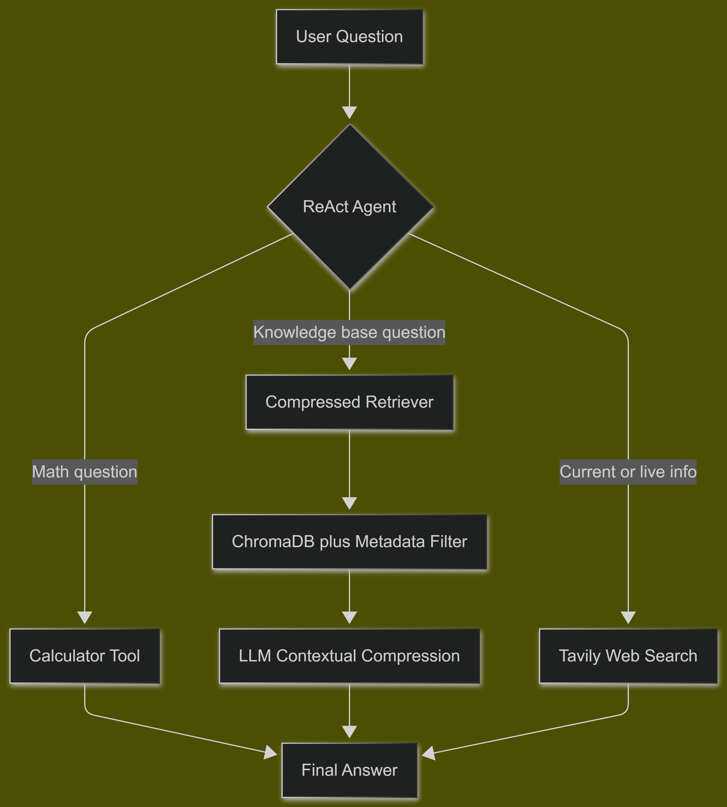

# Agentic RAG Assistant 🤖

[](https://www.python.org)
[](https://langchain.com)
[](LICENSE)
[](https://sameerkhaliq-agentic-rag-assistant.hf.space/)

A ReAct agent that dynamically chooses between **document retrieval**,
**calculation**, and **live web search** based on the query — instead of
always running a fixed retrieval pipeline.

**[Live Interactive Demo →](https://sameerkhaliq-agentic-rag-assistant.hf.space/)**

---

## 🏗️ System Architecture & Workflow

## Architecture


---

## 📊 Benchmarks

### 1. Retrieval quality (RAGAS evaluation, 20 test queries):

| Metric | Score |
|---|---|
| Faithfulness | 1.00 |
| Answer Relevancy | 0.85 |
| Context Recall | 1.00 |

### 2. Contextual compression (5 test queries):

| Metric | Value |
|---|---|
| Average context size reduction | 85.7% |
| Metadata fields filterable | 2 (category, source) |

### 3. Agentic tool selection (15 diverse queries — retrieval / calculation / web search):

| Metric | Score |
|---|---|
| Correct tool selection | 15/15 (100%) |
| Clean execution (verified via observation-level error checking) | 15/15 (100%) |

---

## 💡 Why agentic over fixed-pipeline RAG?

A fixed RAG pipeline always retrieves, regardless of what the query actually
needs — it can't do math, and it can't answer "what's today's date." This
agent reasons about *which* capability a question needs before acting,
using the [ReAct](https://arxiv.org/abs/2210.03629) (Reason + Act) pattern.

---

## 🛠️ Tech stack

LangChain (ReAct agent) · Gemini 2.5 Flash · ChromaDB · Tavily Search · Gradio · RAGAS (evaluation)

---

## 💻 Run locally

```bash
git clone https://github.com/Sameer-khaliq/agentic-rag-assistant.git
cd agentic-rag-assistant
uv venv
uv pip sync requirements.txt
cp .env.example .env  # add your API keys
uv run app.py