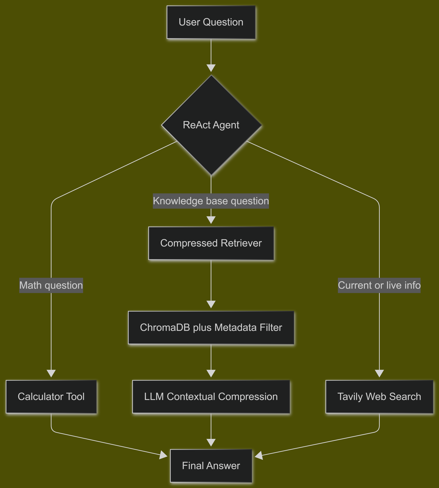

# Agentic RAG Assistant 🤖

[](https://www.python.org)
[](https://langchain.com)
[](https://groq.com)
[](LICENSE)

An intelligent, autonomous ReAct agent that dynamically decides between **local document retrieval**, **safe mathematical calculations**, and **live web search** based on incoming user intent — rather than always forcing a fixed, static retrieval pipeline.

---

## 🏗️ Architecture & Workflow



---

## ✨ Key Features

- **Autonomous Decision Engine:** Powered by Groq's **`openai/gpt-oss-120b`** using a robust ReAct (Reason + Act) loop.
- **Single-Pass Context Compression:** High-speed document fact extraction using Groq's **`openai/gpt-oss-20b`** (reduces prompt context by ~85%).
- **Vector Knowledge Base:** Dense document embeddings using Google Gemini (**`models/gemini-embedding-001`**) stored in a persistent **ChromaDB** vector database.
- **Deterministic Prefilter Gating:** Sub-millisecond local regex layer that intercepts greetings, conversational pleasantries, abusive language, credential leaks, and out-of-scope requests with **0 API calls**, protecting the 8,000 TPM rate limit.
- **Safe AST Calculator:** Evaluates mathematical expressions with an Abstract Syntax Tree whitelist parser, completely eliminating remote code execution (`eval`) risks and DoS loops.
- **Real-Time Web Search:** Integrates **Tavily Search** for current events, real-time facts, and queries beyond the local knowledge base.
- **Graceful Degradation:** Built-in resilience handlers that return user-friendly status responses (`Agent Services unavailable at the moment try again later`) during network drops.
- **Modern Gradio Web UI:** Responsive dark theme interface with dynamic progressive thinking states (Processing $\rightarrow$ Synthesizing $\rightarrow$ Presenting) that vanish immediately when the output is ready.

---

## 📊 Benchmarks

### 1. Retrieval Quality (RAGAS evaluation, 20 test queries)

| Metric | Score |
|---|---|
| **Faithfulness** | 1.00 |
| **Answer Relevancy** | 0.85 |
| **Context Recall** | 1.00 |

### 2. Contextual Compression (5 test queries)

| Metric | Value |
|---|---|
| **Average Context Size Reduction** | 85.7% |
| **Metadata Fields Filterable** | 2 (`category`, `source`) |

### 3. Agentic Tool Selection (15 diverse queries)

| Metric | Score |
|---|---|
| **Correct Tool Selection** | 15/15 (100%) |
| **Clean Execution (Zero Tool Crashes)** | 15/15 (100%) |

---

## 💡 Why Agentic over Fixed-Pipeline RAG?

A traditional fixed RAG pipeline performs vector search for *every single query*, regardless of whether it actually needs document context. It cannot perform mathematical calculations and cannot answer real-time questions like "What's the weather today?". 

This agent uses the [ReAct](https://arxiv.org/abs/2210.03629) framework to reason about **which** tool to deploy:

| User Query | Agent Routing | Action Taken |
| :--- | :--- | :--- |
| `"What is a centralized database?"` | Knowledge Base | ChromaDB $\rightarrow$ Gemini Embeddings $\rightarrow$ Groq 20B Compression |
| `"What is 15 percent of 2400?"` | Calculator | Local Python AST Math Evaluator |
| `"Who is the current CEO of OpenAI?"` | Web Search | Tavily Real-Time Search API |
| `"hi"` / `"who are you"` | Prefilter Gate | Local Instant Response (< 1ms, 0 API calls) |

---

## 🛠️ Tech Stack

- **Reasoning LLM:** Groq `openai/gpt-oss-120b`
- **Context Compression LLM:** Groq `openai/gpt-oss-20b`
- **Embeddings:** Google Gemini `models/gemini-embedding-001`
- **Vector Database:** ChromaDB (Persistent Client)
- **Web Search:** Tavily Search API
- **Agent Framework:** LangChain ReAct (`AgentExecutor` + `RobustReActOutputParser`)
- **Web Interface:** Gradio 6.x (Async streaming + Custom Theme)
- **Package Manager:** [uv](https://github.com/astral-sh/uv)

---

## 💻 Run Locally

### 1. Prerequisites
- Python 3.11 or 3.12
- [uv](https://github.com/astral-sh/uv) package manager installed

### 2. Setup

```bash
# Clone the repository
git clone https://github.com/Sameer-khaliq/agentic-rag-assistant.git
cd agentic-rag-assistant

# Install dependencies
uv sync

# Configure environment variables
cp .env.example .env
```

Edit your `.env` file and add your API keys:
```env
GROQ_API_KEY=your_groq_api_key_here
GEMINI_API_KEY=your_gemini_api_key_here
TAVILY_API_KEY=your_tavily_api_key_here
LOG_LEVEL=INFO
DEBUG=False
AGENT_MAX_ITERATIONS=4
```

### 3. Launch the Web Interface

```bash
uv run python app.py
```
Open **`http://localhost:7860`** in your browser.

### 4. CLI Interface

You can also run direct queries via terminal:

```bash
uv run python main.py "What is a centralized database?"
uv run python main.py "What is 15 percent of 2400?"
```

### 5. Run with Docker

```bash
docker-compose up --build
```

---

## 🧪 Running Tests

The test suite covers unit tests for the AST calculator, prefilter gating, configuration, and robust parser:

```bash
# Run unit tests
uv run pytest tests/test_project.py -v
```

---

## 📄 License

This project is licensed under the MIT License — see the [LICENSE](LICENSE) file for details.